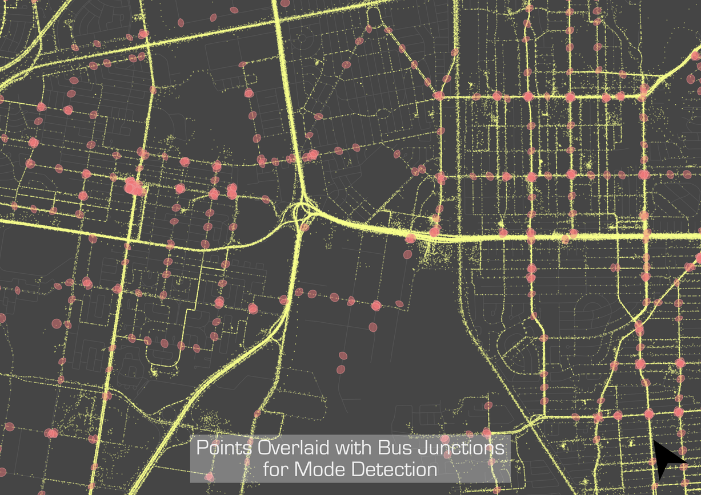

An app for learning about travel patterns using a smartphone does not to be complicated. Its main purpose will be to act in the background recording GPS coordinates and occasionally uploading to a database. Battery life optimizations will be different across various makes and devices, but especially phone operating system. Apple’s iOS is more efficient with a limited pool of hardware to support, but most phones are Android (2015). The specifics of an app are not important for this post, the only concern are the characteristics of the points themselves. Generally this means priorities are collection frequency—resulting in higher resolution tracks, precision—using GPS over cell-tower triangulation or wifi, and a timestamp.

The first step of the procedure is to determine from the raw GPS points in the database when a trip took place. Classification of a trip is a subjective task to begin with, even in natural conversation. “Was stopping at the corner store for some water on the way to work it’s own trip or just part of the commute? Does it matter if it was a 30 second transaction or we had to wait in line a couple minutes while others were served?” With this in mind, it seems unnatural to try to classify our daily patterns by a set of rules, but this remains a simple and effective way to detect trips.

#### The Algorithm

Algorithm can be a scary sounding word that gets tossed around without much consideration to who is listening. I like to think of it like a cooking recipe: you have a list of ingredients and an end goal; the algorithm is the list of steps to get there. In this case, the ingredients include a bunch of latitude and longitude coordinates. Degree-based systems are useful for circumnavigating the world by a ship, but less so when trying to measure the distance between two objects in meters. The first step in the trip finding algorithm is to ensure everything is in a consistent UTM format.

Conceptually, the approach to trip detection is rather simple. Take all the GPS coordinates as a single path and cut it up into the smallest possible trip parts, or segments. Then according to patterns observed in real life (we’ll call these our rules), we stitch these segments back together as individual trips. Since our approach is rule-based or deterministic, the philosophy is to work top-down incrementally: take care of the obvious rules first, look at what is left over, and refine the procedure with something a little more specific.

The second step is most dependent on how often our smartphone app collects a measurement, since the segments are first divided by periods of inactivity. The app used in this research assists by attempting to set a geofence which will deactivate the device GPS when a user remains in a single spot for a prolonged period. The algorithm creates its atomic segments when it finds a time gap of six minutes or greater between points.

In the next step, we include some more ingredients for our algorithm. Some of the detected time gaps occur when a user is waiting for a bus or riding the subway, so we need to know where the pickup points and stations are. A subway trip is pretty noticeable as a user seemingly disappears from one part of the city and reappears in another in a relatively short timespan. By testing the start and end point of each trip segment, the algorithm checks whether a metro station is present within a certain distance (300m). If there is one near both points, and the stations aren’t actually the same station, the algorithm tests whether a user disappears for less than 80 minutes (the maximum possible trip length on the Montréal metro plus 10 minutes for waiting on the platform) and travelled an average of ≥10 cm/s during that time. If these conditions are all true, the algorithm stitches the segments together and makes note of it as a metro trip (to be used in summary statistics and mode detection). When two or more segments are found to be connected by metro, these segments are flattened into a single new trip segment.

The next step operates similarly for bus trips, however the user does not disappear from the map completely. Instead, this part of the algorithm tests whether the start and end point of all segments occur within bus stop junctions, joins these segments to the adjacent ones and flattens them to a new segment as before. By doing this, it’s assumed that all bus trips will also have walking segments to and from the station (Stopher?). The time break rule is relaxed to 10 minutes (it’s kept so we don’t start over-classifying bus trips), as we assume this to be a maximum bus waiting period. Of course, this isn’t always the case but is a reasonable assumption under normal conditions.

Sometimes as a user is traveling, GPS points will stop collecting (inexplicably, from the researchers’ point of view). This can happen when a driver goes through a long tunnel, but is also observed during otherwise normal travel periods. The algorithm accounts for this by performing a velocity check between segments. If the distance between them is greater than average walking speed (taken as 5 m/s) for the time gap length, these segments are stitched together.

The last step in the algorithm is to look for missing trips, which occurs when a user disables the app and travels to a new destination before re-enabling it again. With the metro trips filtered out, the remaining trips missing connections will be the missing trips. Keeping track of the missing trips creates a connected path of a user’s stops around the city.