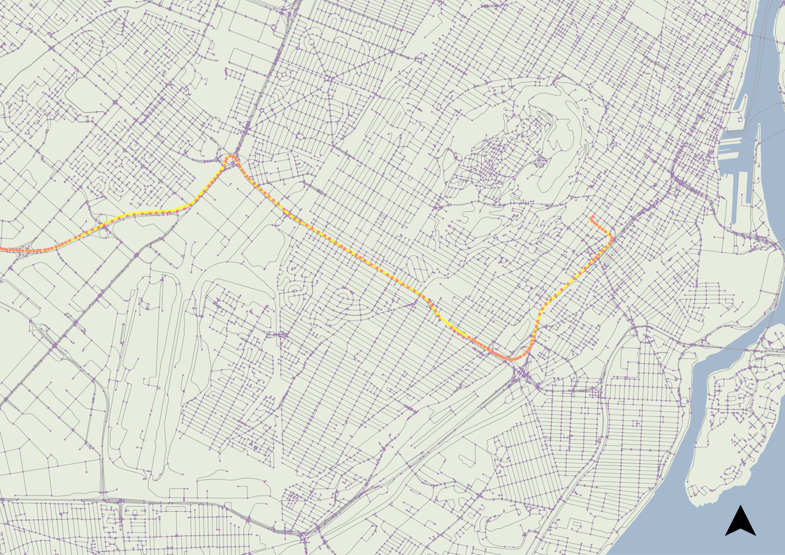
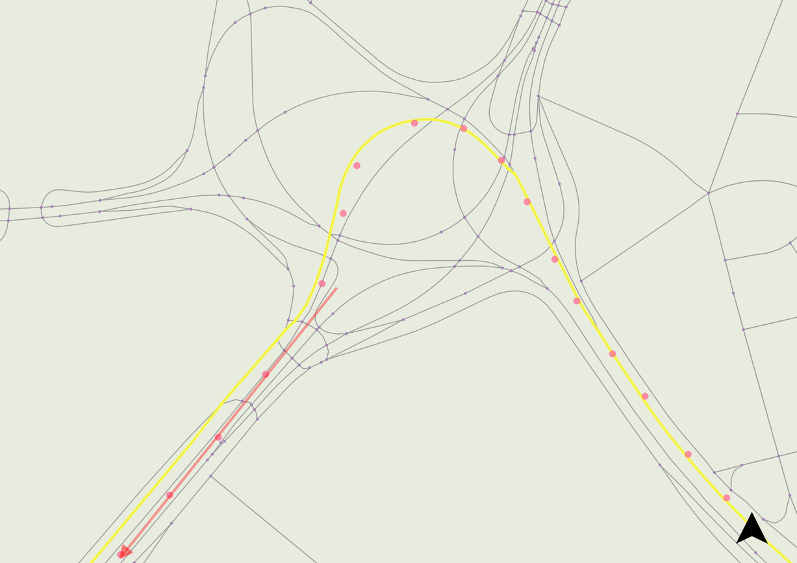

When trip breaking has been performed on the database of collected GPS points, it is useful to know which roads a user has traveled along. Any person could easily figure out the routes taken by overlaying GPS points on a street map. Looking at our point set, it’s easy to tell which direction a user is going if they're driving on the right side of the highway, but explaining that to a computer is another matter. Luckily, this network type of driving network can be simply encoded using edges and nodes. Each street constitutes an edge and each intersection is coded as a node (point). Each edge contains information about which nodes it is connected to as well as legal vehicle travel direction.

The map matching approach below is modeled after the Multiple Hypothesis Technique laid out in Schuessler & Axhausen, 2009. The paper focuses on determining an accurate matching approach in a computationally efficient manner, a concern previous map matching approaches often lacked.

To get started, I installed PostGIS and loaded my road network data. When dealing with a data source like OpenStreetMap, additional steps are needed to create the edge and node network off the coordinates of the street grid and information about elevation for overpasses. Since I was implementing the algorithm to run on the directed street greet, I isolated a clear example of a car trip from the GPS points for testing. As with trip breaking, the first step to start off is re-projecting the points in WGS84 to a projected meter grid.

To begin the matching, the trip is first trimmed so the start and end point are within 10m of a road segment. This is done since there can be significant variation from early GPS points as the device establishes an accurate fix. The algorithm begins its search by looking for all endnodes within 750m of the start point. For each endnode identified, candidate routes are generated depending on the edge’s direction rule (whether the segment is one-way or bidirectional). The endnode search radius is expanded in 100m increments until at least 25 candidate routes have been generated (simply called candidates from here on).

For each of the coordinates following the trip start point, tests whether the new point should be matched the current furthest candidate segment (from the origin GPS point) or whether a new link should be added to the candidate path. After each round of candidate generation, the potential routes are scored by a process termed relevant perpendicular distance. This distance between each coordinate and closest link segment is summer and the candidate path with the lowest score is considered the best match. If a coordinate belongs to the furthest existing segment along a candidate route, its score is factored into the candidate route and the next GPS coordinate is processed. If a new segment is needed, the algorithm selects all possible segments with a listed fromnode of the furthest available intersection. As the candidate network branches at most intersections, the highest scoring (poorest matches) candidate routes are trimmed until there is ≤40 total.

This new potential route is validated by three tests. First, the algorithm ensures that this new route is not a duplicate of an existing candidate. Secondly, it checks that a route does not double-back on itself. Lastly, we search through the whole candidate route to make sure a segment is not being used twice. These rules are not strictly always true in real life, but very uncommon events. I believe the reasoning is inclusion of these could lead to runaway loop generation in an undirected network, but it’s possible a directed network does not have these issues—this is worth looking into.

After this process is complete, the lowest scoring candidate out of our pool is our closest possible route match.

As mentioned, the included rule tests should be tested for relevancy on a directed network. Additionally, non-vehicle modes should be tested on the undirected network since movement is not directionally bounded for walking or biking. Lastly, this method currently only tests against the street network however other modal networks such as bus and metro should be considered.

In testing, this algorithm performs very well between both rectilinear grids and suburban loops-and-lollipops. An area of potential confusion (as commonplace amongst alternative map matching algorithms) are multilane roads like highways. In my personal experience, this issue was likely caused by construction reconfiguring real-life locations from my network data from several years ago. Nevertheless, a test could be performed to detect problem spots by identifying segments with long periods of low cumulative matching error to an adjacent, parallel segment.

*A mismatch due to outdated topological network data compared to new interchange configuration*
